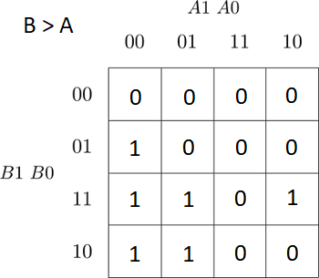
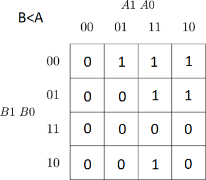
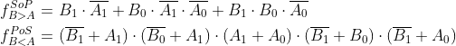

# Lab 2: Radim Pařízek

### 2-bit comparator

1. Karnaugh maps for other two functions of 2-bit comparator:

   Greater than:

   

   Less than:

   

2. Mark the largest possible implicants in the K-map and according to them, write the equations of simplified SoP (Sum of the Products) form of the "greater than" function and simplified PoS (Product of the Sums) form of the "less than" function.

   

### 4-bit comparator

1. Listing of VHDL stimulus process from testbench file (`testbench.vhd`) with at least one assert (use BCD codes of your student ID digits as input combinations). Always use syntax highlighting, meaningful comments, and follow VHDL guidelines:

   Last two digits of my student ID: **83 = BCD(1000 0011)**

```vhdl
     p_stimulus : process
    begin
        report "Stimulus process started";

        s_b <= "0000"; s_a <= "0000"; wait for 100 ns;
        assert ((s_B_greater_A = '0') and
                (s_B_equals_A  = '1') and
                (s_B_less_A    = '0'))
        report "Input combination b=0, a=0 FAILED" severity error;


        s_b <= "0001"; s_a <= "1000"; wait for 100 ns;
        assert ((s_B_greater_A = '0') and
                (s_B_equals_A  = '0') and
                (s_B_less_A    = '1'))
        report "Input combination b=1, a=8 FAILED" severity error;
        
        s_b <= "1001"; s_a <= "1001"; wait for 100 ns;
        assert ((s_B_greater_A = '0') and
                (s_B_equals_A  = '1') and
                (s_B_less_A    = '0'))
        report "Input combination b=9, a=9 FAILED" severity error;
        
        
        
        --chyba při assertu
        s_b <= "0011"; s_a <= "1000"; wait for 100 ns;
        assert ((s_B_greater_A = '1') and
                (s_B_equals_A  = '0') and
                (s_B_less_A    = '0'))
        report "Input combination b=3, a=8 FAILED successfully" severity error;
        
        
        
        --test posledních dvou čísel v mém ID - xxx x83
        s_b <= "1000"; s_a <= "0011"; wait for 100 ns;
        assert ((s_B_greater_A = '1') and
                (s_B_equals_A  = '0') and
                (s_B_less_A    = '0'))
        report "Input combination b=8, a=3 FAILED" severity error;
        
        
        
        report "Stimulus process finished";
        wait;
    end process p_stimulus;
```

2. Link to your public EDA Playground example:

   [EDA Playground 4-bit BCD comparator](https://www.edaplayground.com/x/nKeq)
