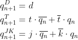

## Pre-Lab preparation

1. Write characteristic equations and complete truth tables for D, JK, T flip-flops where `q(n)` represents main output value before the clock edge and `q(n+1)` represents output value after the clock edge.

   
   <!--
   https://editor.codecogs.com/

   \begin{align*}
   q_{n+1}^{D} =&~ d\\
   q_{n+1}^{T} =&~ t\cdot\overline{q_{n}} + \overline{t}\cdot q_{n}\\
   q_{n+1}^{JK} =&~ j\cdot\overline{q_{n}} + \overline{k}\cdot q_{n}\\
   \end{align*}

   -->
   
   **D-type FF**
   |             **clk**              | **d** | **q(n)** | **q(n+1)** | **Comments**                       |
   | :------------------------------: | :---: | :------: | :--------: | :--------------------------------- |
   |  |   0   |    0     |     0      | 'q_n+1' set to 'd'                 |
   |  |   0   |    1     |     0      | 'q_n+1' set to 'd'                 |
   |  |   1   |    0     |     1      | 'q_n+1' set to 'd'                 |
   |  |   1   |    1     |     1      | 'q_n+1' set to 'd'                 |
   
   **JK-type FF**
   |             **clk**              | **j** | **k** | **q(n)** | **q(n+1)** | **Comments**          |
   | :------------------------------: | :---: | :---: | :------: | :--------: | :-------------------- |
   |  |   0   |   0   |    0     |     0      | Output did not change |
   |  |   0   |   0   |    1     |     1      | Output did not change |
   |  |   0   |   1   |    0     |     0      | Reset                 |
   |  |   0   |   1   |    1     |     0      | Reset                 |
   |  |   1   |   0   |    0     |     1      | Set                   |
   |  |   1   |   0   |    1     |     1      | Set                   |
   |  |   1   |   1   |    0     |     1      | Toggle                |
   |  |   1   |   1   |    1     |     0      | Toggle                |
   
   **T-type FF**
   |             **clk**              | **t** | **q(n)** | **q(n+1)** | **Comments**          |
   | :------------------------------: | :---: | :------: | :--------: | :-------------------- |
   |  |   0   |    0     |     0      | Output did not change |
   |  |   0   |    1     |     1      | Output did not change |
   |  |   1   |    0     |     1      | Toggle                |
   |  |   1   |    1     |     0      | Toggle                |
