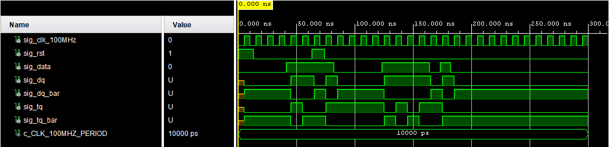

# Lab 5: Radim Pařízek

### D & T Flip-flops

1. Screenshot with simulated time waveforms. Try to simulate both D- and T-type flip-flops in a single testbench with a maximum duration of 200 ns, including reset. Always display all inputs and outputs (display the inputs at the top of the image, the outputs below them) at the appropriate time scale!

   

### JK Flip-flop

1. Listing of VHDL architecture for JK-type flip-flop. Always use syntax highlighting, meaningful comments, and follow VHDL guidelines:

```vhdl
architecture Behavioral of jk_ff_rst is
    signal sig_q : std_logic;
begin
    --------------------------------------------------------
    -- p_jk_ff_rst:
    -- JK type flip-flop with a high-active synchro reset and
    -- rising-edge clk.
    -- sig_q = j./sig_q + /k.sig_q
    --------------------------------------------------------
    p_jk_ff_rst: process (clk) is
    begin
        if rising_edge(clk) then
            if (j = '0') and (k = '0') then
                sig_q <= sig_q;     -- No change
            elsif (j = '0') and (k = '1') then
                sig_q <= '0';       -- Reset
            elsif (j = '1') and (k = '0') then
                sig_q <= '1';       -- Set
            elsif (j = '1') and (k = '1') then
                sig_q <= not sig_q; -- Toggle
            end if;
        end if;
    end process p_jk_ff_rst;

    q     <= sig_q;
    q_bar <= not sig_q;
end architecture behavioral;
```

### Shift register

1. Image of `top` level schematic of the 4-bit shift register. Use four D-type flip-flops and connect them properly. The image can be drawn on a computer or by hand. Always name all inputs, outputs, components and internal signals!

   
